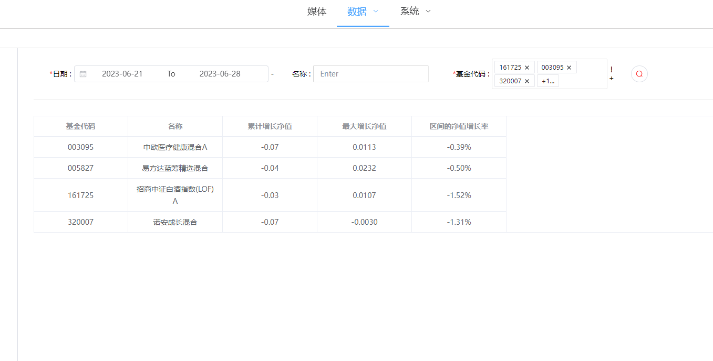

[前端项目地址](https://github.com/fevolq/Front)

[后端项目地址](https://github.com/fevolq/Backend)

[接口文档]()

# 介绍
本项目基于flask，实现了**用户系统、数据分析**等。

# 分支划分
* main: 主分支
* test: 测试分支
* init: 项目初始化构建
* assess: 静态资源
* feature/: 功能分支

# 进度
* 用户系统：完成
* 数据分析：迭代中

# 示例
* 基金

